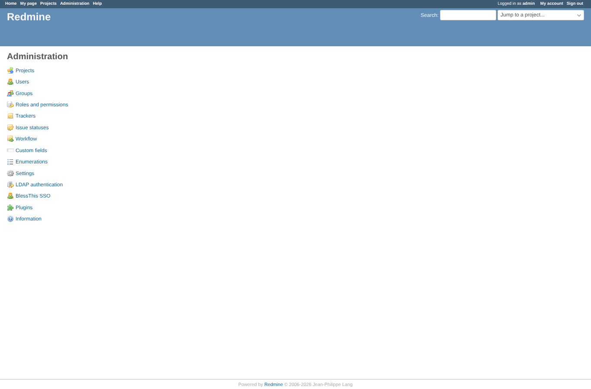
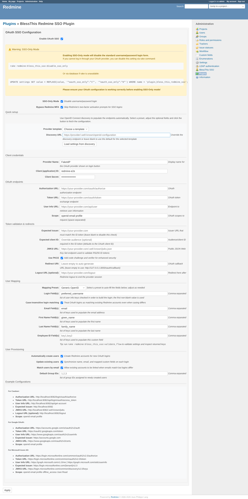
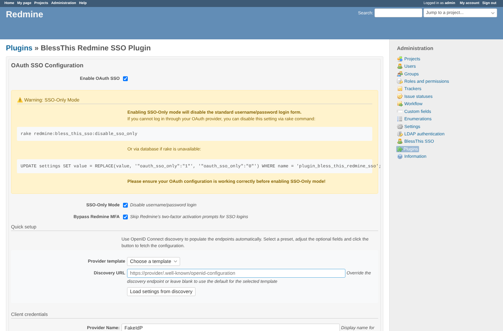
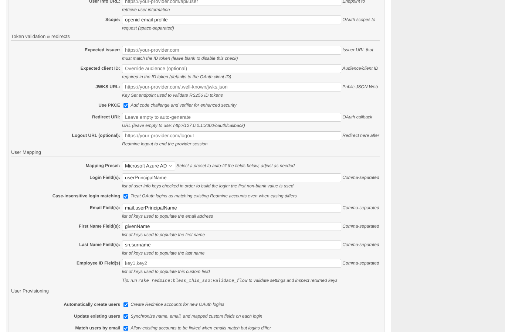
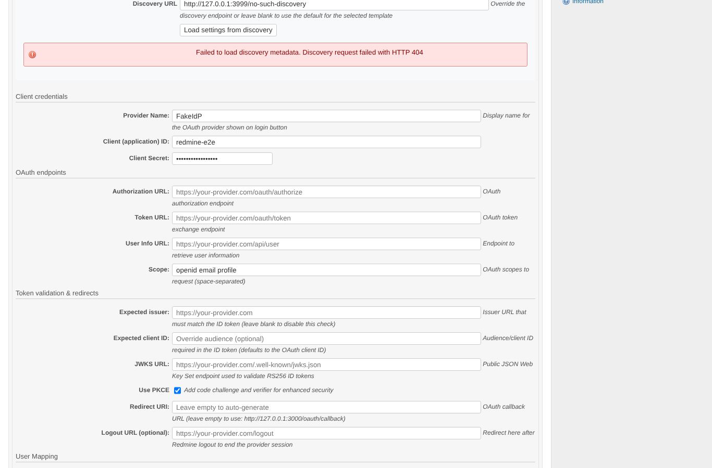
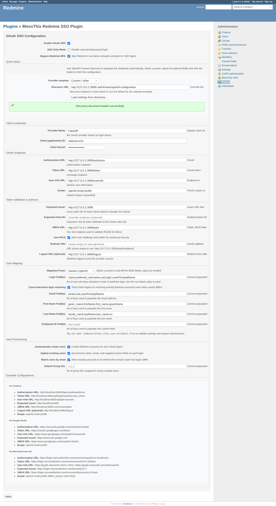
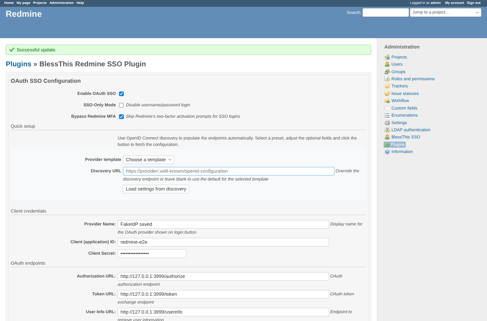
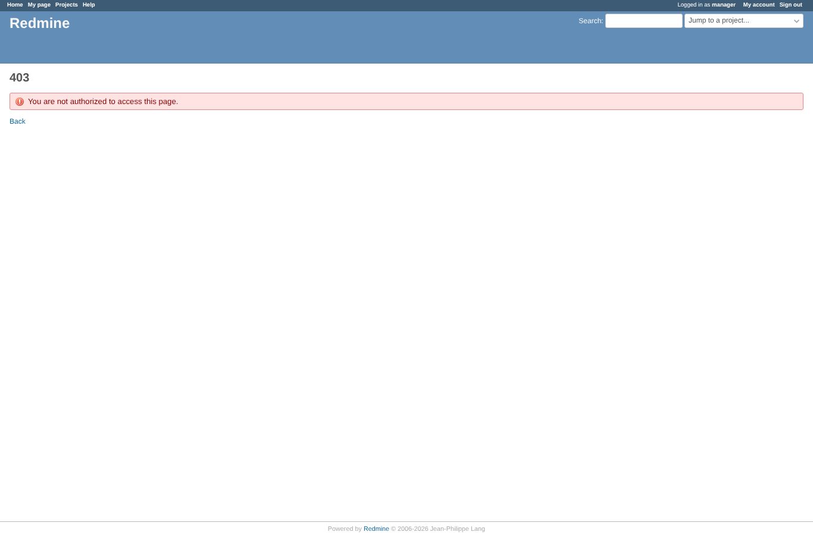
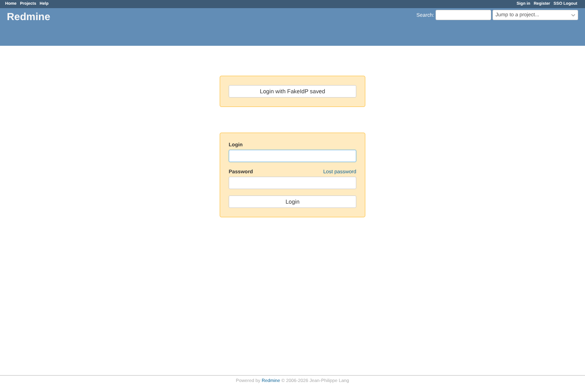

# settings

Run 2026-10-06T20:02:27.437Z against http://127.0.0.1:3000.

| screenshot | user | URL | shows |
|---|---|---|---|
|  | admin | `/admin` | Administration menu: "BlessThis SSO" with the user icon like the core entries |
|  | admin | `/settings/plugin/bless_this_redmine_sso` | Plugin settings page as admin |
|  | admin | `/settings/plugin/bless_this_redmine_sso` | Ticking SSO-only shows the lock-out warning with the recovery commands |
|  | admin | `/settings/plugin/bless_this_redmine_sso` | Choosing the Microsoft preset fills login/email/name claims (userPrincipalName, mail, givenName, sn) |
|  | admin | `/settings/plugin/bless_this_redmine_sso` | Discovery against a URL that answers 404: an error under the button, no field changed |
|  | admin | `/settings/plugin/bless_this_redmine_sso` | Discovery from the provider's openid-configuration fills endpoints, issuer and JWKS URL |
|  | admin | `/settings/plugin/bless_this_redmine_sso` | Saved after the sudo password: notice shown, values from discovery stored |
|  | anonymous | `/login` | Login page after saving: the button carries the saved provider name |
|  | manager | `/settings/plugin/bless_this_redmine_sso` | manager (not admin): the settings page answers 403, and POST /oauth/discover answers 403 |
|  | reporter | `/settings/plugin/bless_this_redmine_sso` | reporter (not admin): the settings page answers 403, and POST /oauth/discover answers 403 |
|  | outsider | `/settings/plugin/bless_this_redmine_sso` | outsider (not admin): the settings page answers 403, and POST /oauth/discover answers 403 |
|  | anonymous | `/login?back_url=http%3A%2F%2F127.0.0.1%3A3000%2Fsettings%2Fplugin%2Fbless_this_redmine_sso` | Anonymous: the settings page sends to /login; POST /oauth/discover is refused |

## Problems

- expectation failed: admin menu item has a sprite icon
