# sso_login

Run 2026-10-06T20:03:33.455Z against http://127.0.0.1:3000.

| screenshot | user | URL | shows |
|---|---|---|---|
| 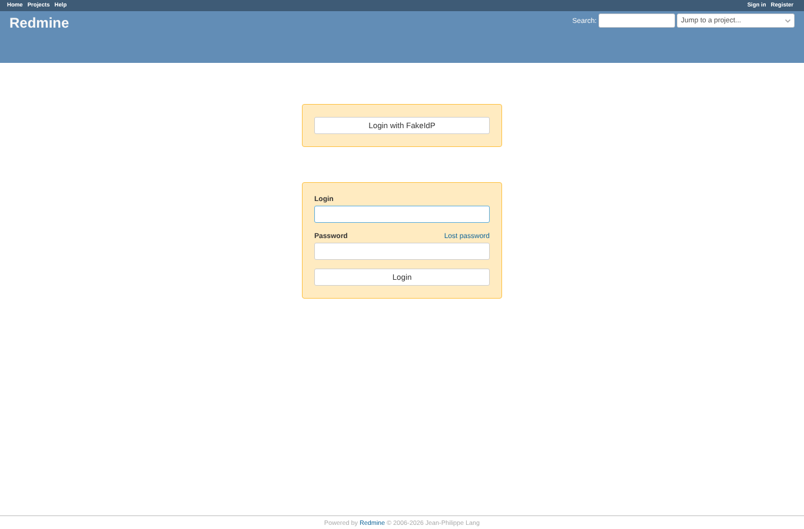 | anonymous | `/login?back_url=http%3A%2F%2F127.0.0.1%3A3000%2Fissues%2F1` | Login page with the "Login with FakeIdP" button above the password form |
|  | anonymous | `http://127.0.0.1:3999/authorize?client_id=redmine-e2e&redirect_uri=http%3A%2F%2F127.0.0.1%3A3000%2Foauth%2Fcallback&scope=openid+email+profile&response_type=code&state=28abf701161660fc9afa28c59f4693c7&code_challenge=cYQEO5Z-uQOl91kc6WWGyP55Wa3sVHy7J4DAATQx5I0&code_challenge_method=S256` | At the provider: request from redmine-e2e with PKCE S256, no prompt |
| 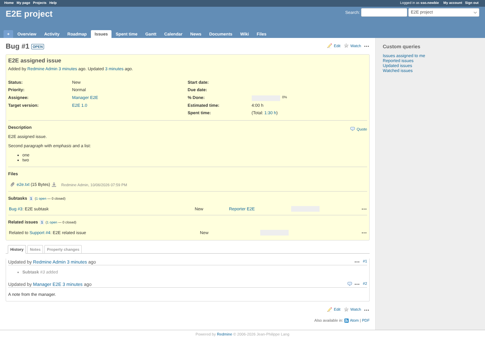 | anonymous | `/issues/1` | New user sso.newbie created and logged in, landed on /issues/1 (back_url) |
| 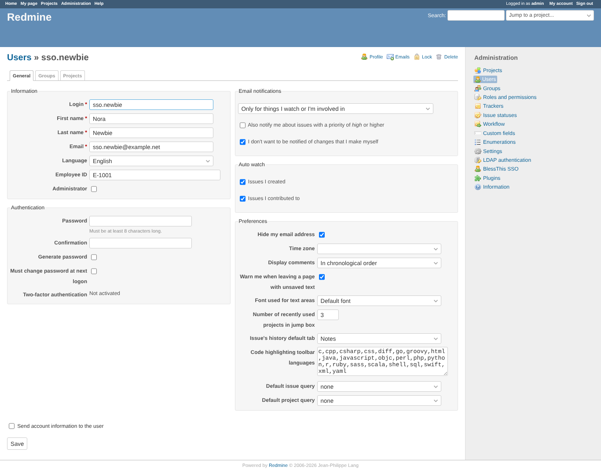 | admin | `/users/10/edit` | Admin view of the created user: name, e-mail, Employee ID E-1001, group SSO staff |
|  | anonymous | `/my/page` | Existing user manager logged in through SSO; name now "Managed ByIdP" from the provider |
| 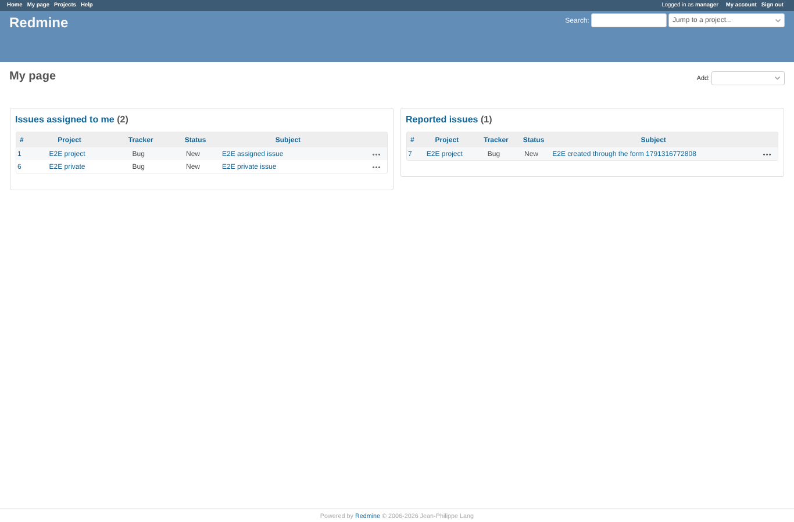 | anonymous | `/my/page` | Update existing off: manager logged in, name stays "Manager E2E" |
| 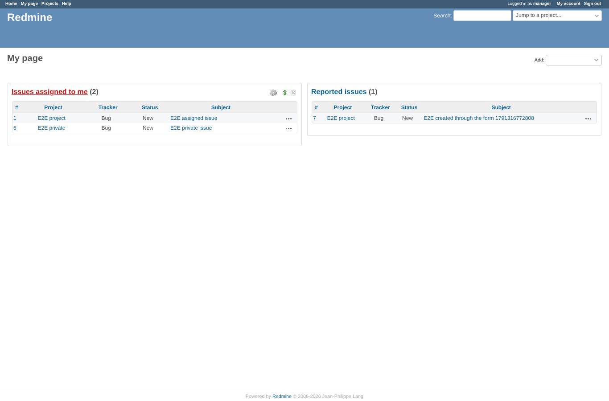 | anonymous | `/my/page` | Provider sends MANAGER; case-insensitive matching logs in the existing manager |
|  | anonymous | `/login` | Case-sensitive on: MANAGER is not manager, and creating it is refused (login taken) |
| 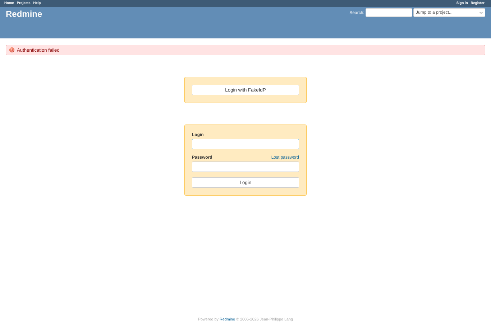 | anonymous | `/login` | Auto-create off, login r.porter unknown, email matching off: refused with an error |
| 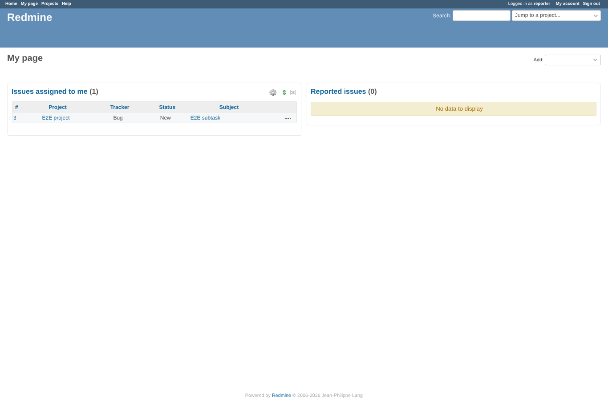 | anonymous | `/my/page` | Match by email on: provider login r.porter, e-mail reporter@example.net, logged in as reporter |
| 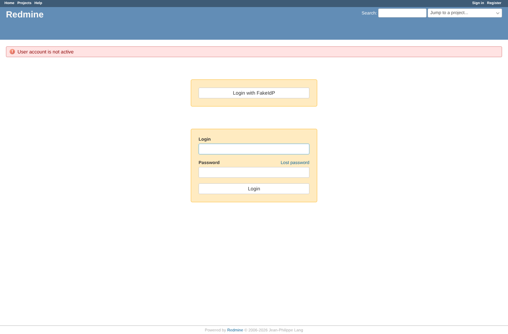 | anonymous | `/login` | A locked Redmine user is refused after a valid SSO login |
| 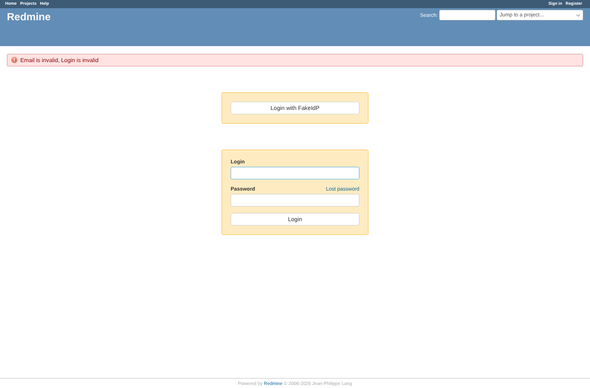 | anonymous | `/login` | Claims that fail user validation (login "bad login!", e-mail "not-an-email"): errors shown, no user created |
| 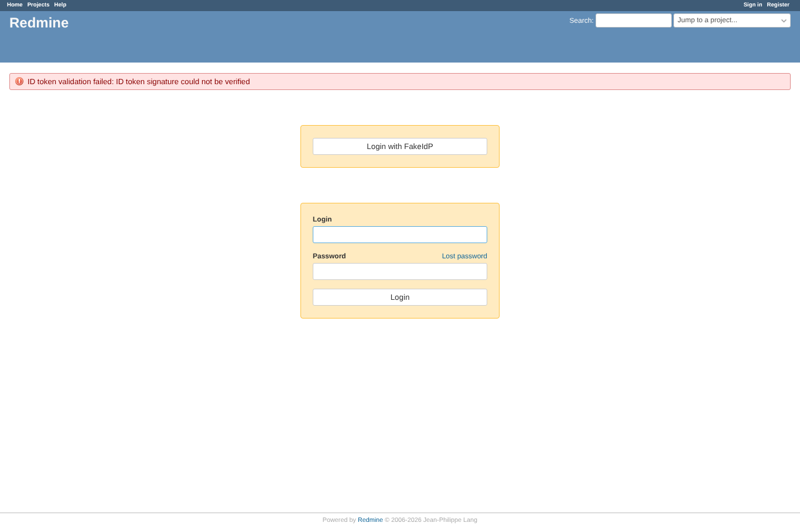 | anonymous | `/login` | id_token signed with a key not in the JWKS: refused, no user created |
| 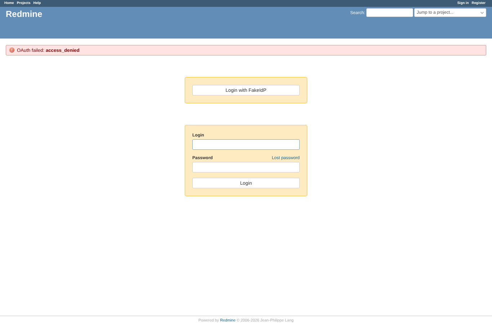 | anonymous | `/login` | Provider answers error=<b>access_denied</b>: refused, the markup is shown as text, not rendered |
|  | anonymous | `/login` | Callback with a state that is not in the session: refused |

## Problems

- expectation failed: provider error shown escaped (OAuth failed: <b>access_denied</b>)
