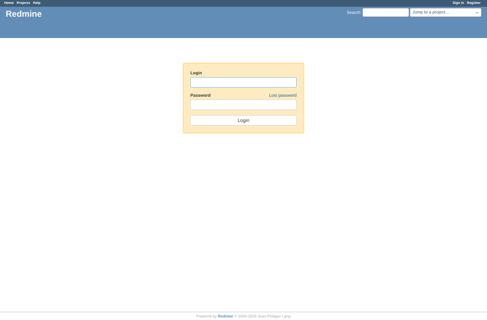
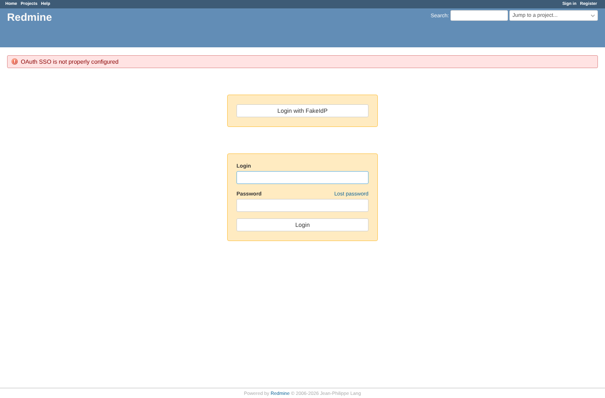
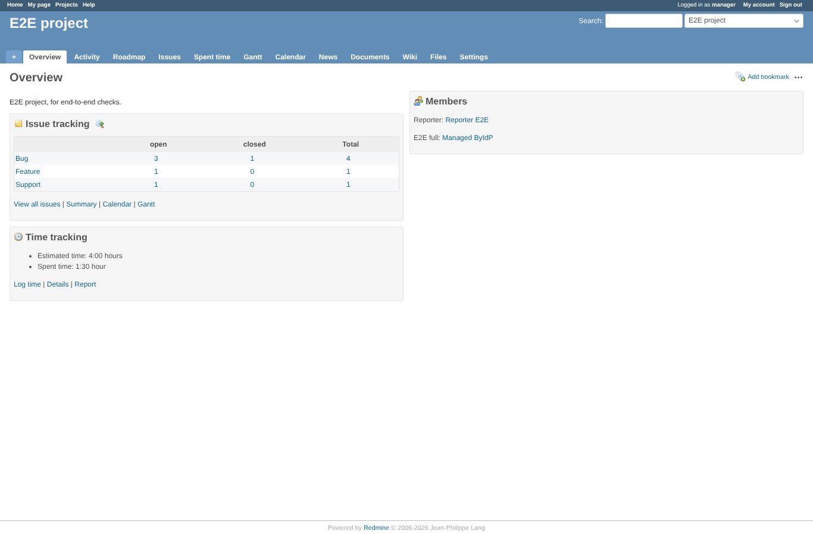
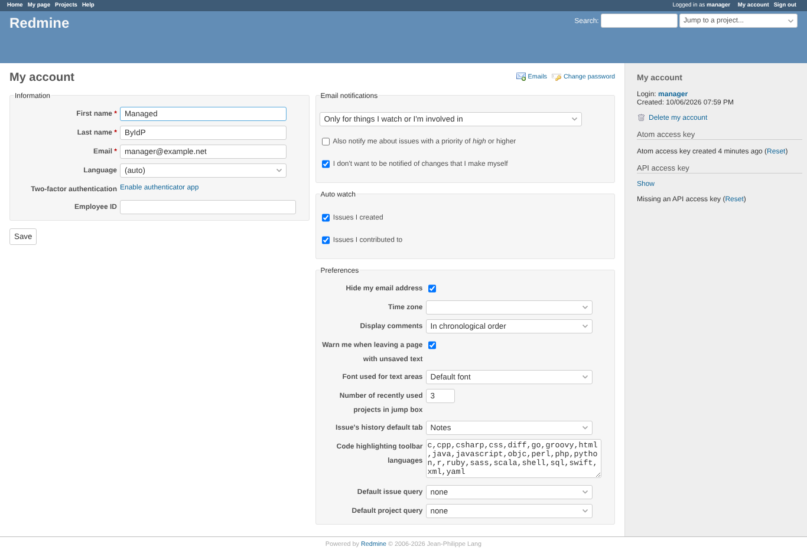

# sso_only

Run 2026-10-06T20:04:31.154Z against http://127.0.0.1:3000.

| screenshot | user | URL | shows |
|---|---|---|---|
|  | anonymous | `/login` | Plugin disabled: the login page is core only, no SSO button |
|  | anonymous | `/oauth/sso/authorize` | Plugin disabled: /oauth/sso/authorize goes back to /login with "not configured" |
|  | anonymous | `/login` | Enabled but the token URL is empty: the button leads back to /login with an error |
|  | anonymous | `http://127.0.0.1:3999/authorize?client_id=redmine-e2e&redirect_uri=http%3A%2F%2F127.0.0.1%3A3000%2Foauth%2Fcallback&scope=openid+email+profile&response_type=code&state=6b7423215c541838a9bdf45e1a43313c&code_challenge=Qvy-waCezPzCEVMo3anK9QipKrQUVWW2Kz3ssjwmPJs&code_challenge_method=S256` | SSO-only: /login goes straight to the provider (no Redmine password form) |
|  | anonymous | `/projects/e2e-project` | SSO-only login as manager returns to the project page it started from |
|  | anonymous | `/my/account` | Anonymous on /my/account in SSO-only mode: provider, then back on /my/account as manager |
|  | anonymous | `http://127.0.0.1:3999/authorize?client_id=redmine-e2e&redirect_uri=http%3A%2F%2F127.0.0.1%3A3000%2Foauth%2Fcallback&scope=openid+email+profile&response_type=code&state=9f851ec0b30149e19b865b444017930c&code_challenge=fxSAnFU2E2MASDzLLCCt46QLD4Rrpm9w-n_cevcm4hE&code_challenge_method=S256` | After the documented recovery SQL: /login shows the password form again (no restart needed) |

## Problems

- /oauth/sso/authorize as anonymous: HTTP 404, expected 200
- expectation failed: disabled: /oauth/sso/authorize refuses
- expectation failed: SSO-only GET /login is a 302 to /oauth/sso/authorize (302 http://127.0.0.1:3000/oauth/authorize)
- expectation failed: after the recovery SQL the password form is back
