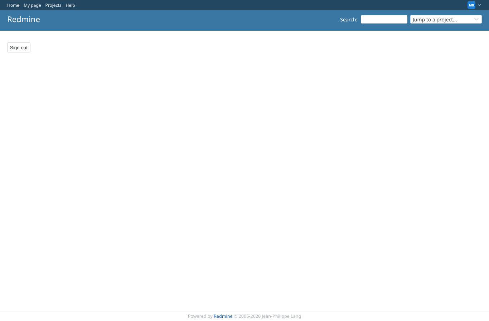
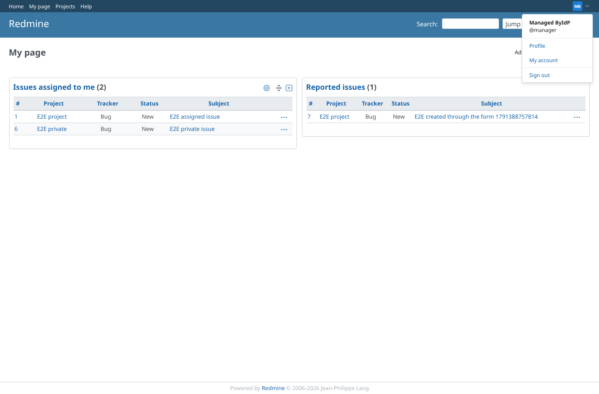
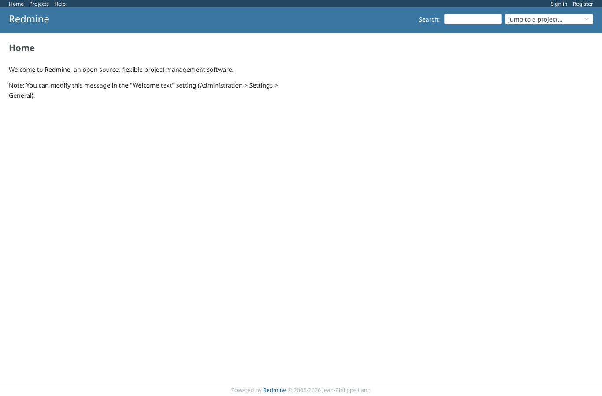
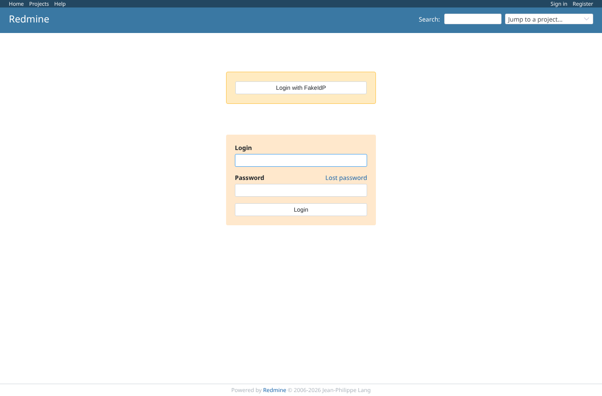

# logout

Run 2026-10-07T15:59:47.641Z against http://127.0.0.1:3000.

| screenshot | user | URL | shows |
|---|---|---|---|
|  | anonymous | `/logout` | GET /logout shows core's confirmation form; the SSO user stays logged in |
|  | anonymous | `/my/page` | Account menu of the SSO user with "Sign out" |
|  | anonymous | `/` | Sign out with a provider logout URL configured: back on Redmine's home page as anonymous, the provider was not contacted |
|  | anonymous | `http://127.0.0.1:3999/authorize?client_id=redmine-e2e&redirect_uri=http%3A%2F%2F127.0.0.1%3A3000%2Foauth%2Fcallback&scope=openid+email+profile&response_type=code&state=9c6b9baaf032e360019e72c760c8ae9c&code_challenge=tqu7J517bv-wBvhxHXk_vX365n3j1jEgK4A2omu74Dc&code_challenge_method=S256` | Next SSO login after signing out: no prompt=login (outlined "(none)"), the provider session is reused |
|  | anonymous | `/login` | Login page: the separate "SSO Logout" link (outlined) to the provider's logout URL, for whoever wants to end the provider session too |
|  | anonymous | `http://127.0.0.1:3999/logout` | Following "SSO Logout": the provider's logout page |
|  | anonymous | `/login` | No logout URL configured: no "SSO Logout" link on the login page |
