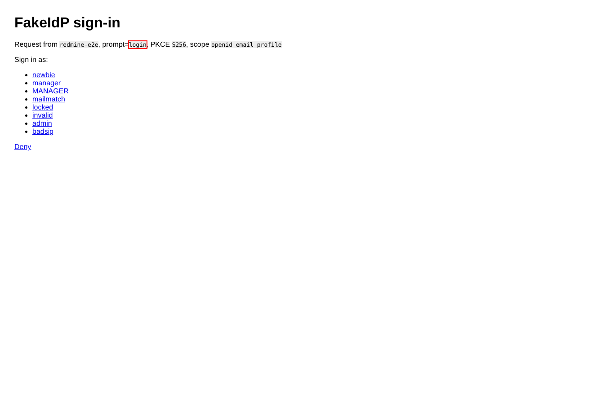

# logout

Run 2026-10-06T19:42:44.377Z against http://127.0.0.1:3000.

| screenshot | user | URL | shows |
|---|---|---|---|
|  | anonymous | `/logout` | GET /logout shows core's confirmation form; the SSO user stays logged in |
|  | anonymous | `/my/page` | Account menu of the SSO user with "Sign out" |
|  | anonymous | `http://127.0.0.1:3999/logout` | Sign out: Redmine session ended and the browser is at the provider's logout URL |
|  | anonymous | `/login` | Login page: the plugin adds an "SSO logout" link (outlined) to the anonymous account menu |
|  | anonymous | `/` | No logout URL: core sign out, back on the home page as anonymous |
|  | anonymous | `http://127.0.0.1:3999/authorize?client_id=redmine-e2e&redirect_uri=http%3A%2F%2F127.0.0.1%3A3000%2Foauth%2Fcallback&scope=openid+email+profile&response_type=code&state=81f1998a85d60e0ad2b841f492c85066&prompt=login&code_challenge=yp27C35N9j-BFdtc3pwBplMwTIvtGD5wmVI1BV-6L-g&code_challenge_method=S256` | Next SSO login after a sign out: the provider receives prompt=login (outlined), so it asks for credentials |
