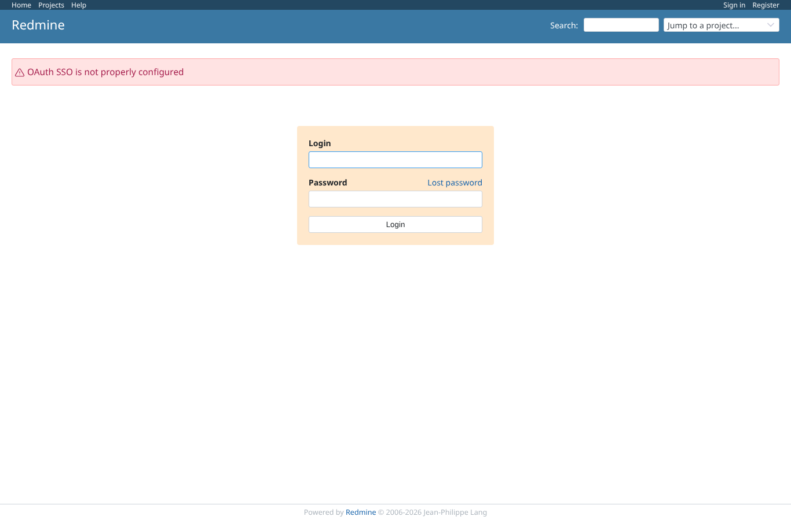
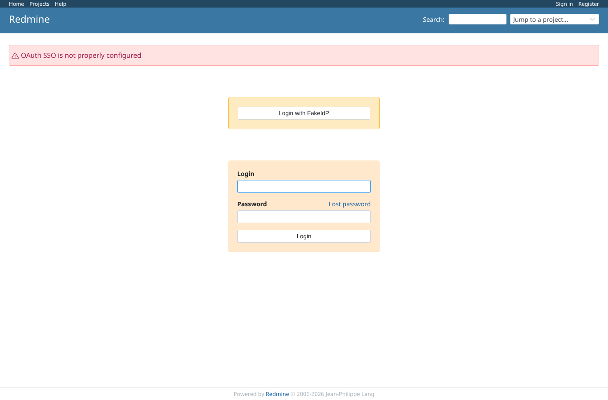
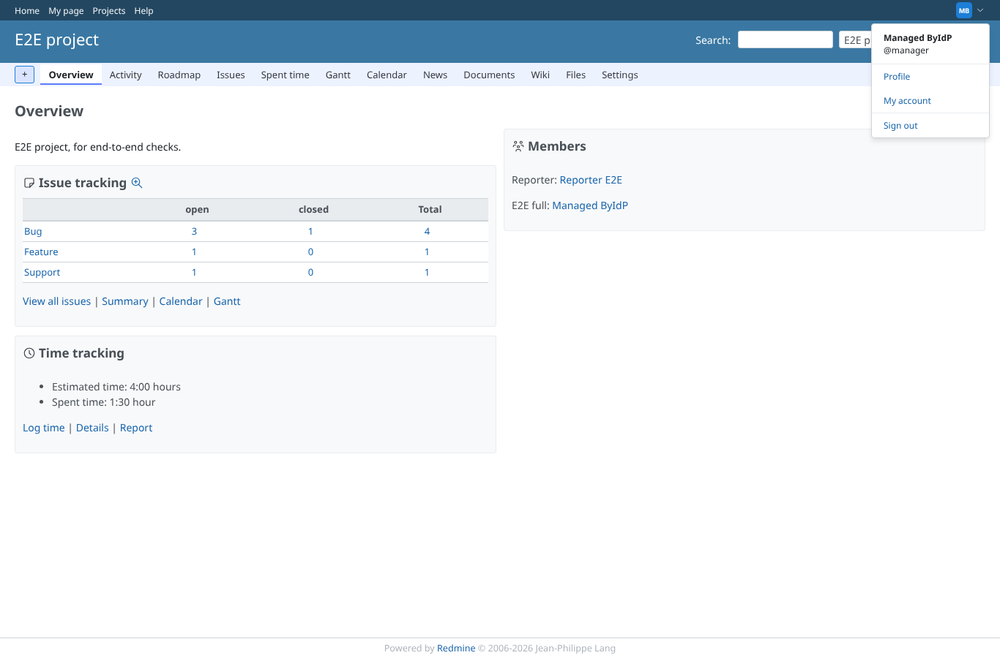
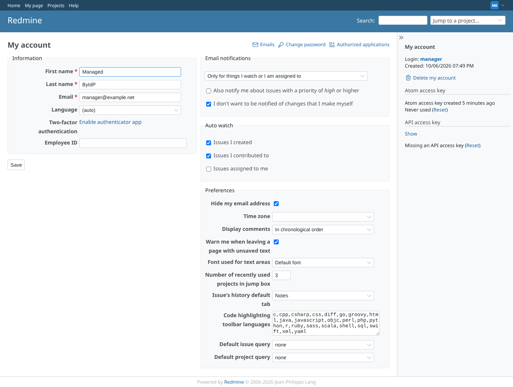
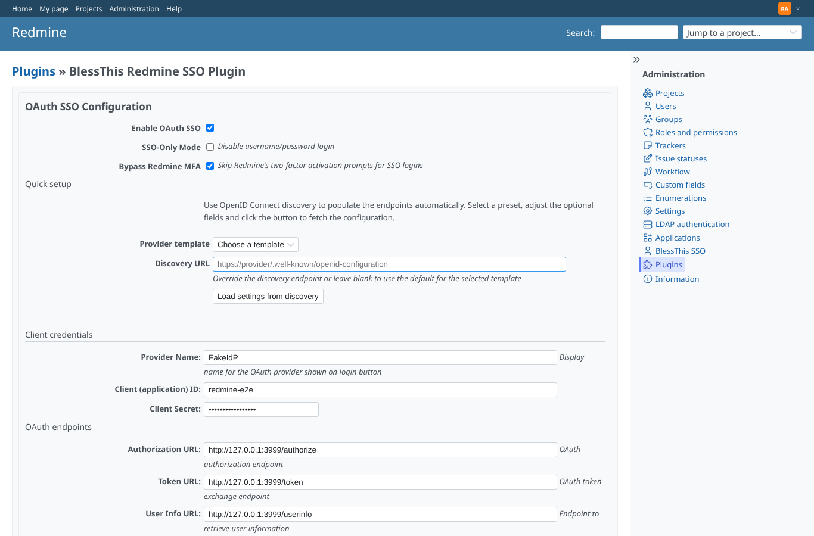

# sso_only

Run 2026-10-06T19:55:56.905Z against http://127.0.0.1:3000.

| screenshot | user | URL | shows |
|---|---|---|---|
|  | anonymous | `/login` | Plugin disabled: the login page is core only, no SSO button |
|  | anonymous | `/login` | Plugin disabled: /oauth/sso/authorize goes back to /login with "not configured" |
|  | anonymous | `/login` | Enabled but the token URL is empty: the button leads back to /login with an error |
|  | anonymous | `http://127.0.0.1:3999/authorize?client_id=redmine-e2e&redirect_uri=http%3A%2F%2F127.0.0.1%3A3000%2Foauth%2Fcallback&scope=openid+email+profile&response_type=code&state=a6fedc227e9c777e5a8c950c12b61ffd&code_challenge=uwQFGL5MlBvifb1gcUZKlJ7Xuued55-i6gXXWaXnJR0&code_challenge_method=S256` | SSO-only: /login goes straight to the provider (no Redmine password form) |
|  | anonymous | `/projects/e2e-project` | SSO-only login as manager returns to the project page it started from |
|  | anonymous | `/my/account` | Anonymous on /my/account in SSO-only mode: provider, then back on /my/account as manager |
|  | anonymous | `/login` | After the documented recovery SQL: /login shows the password form again (no restart needed) |
|  | admin | `/settings/plugin/bless_this_redmine_sso` | Settings after recovery: SSO enabled, SSO-only unchecked (stored as '0'), so saving keeps it off |
