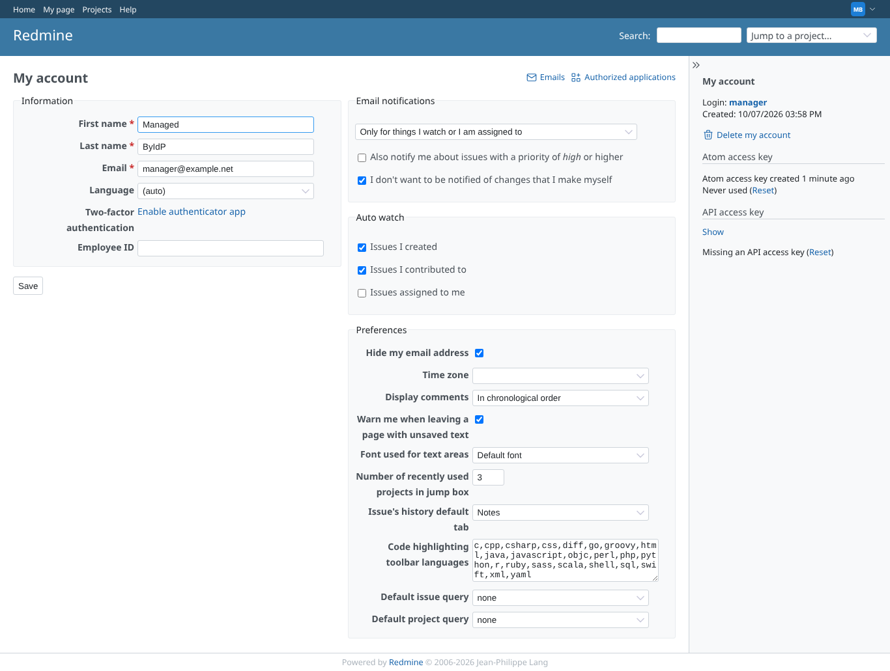
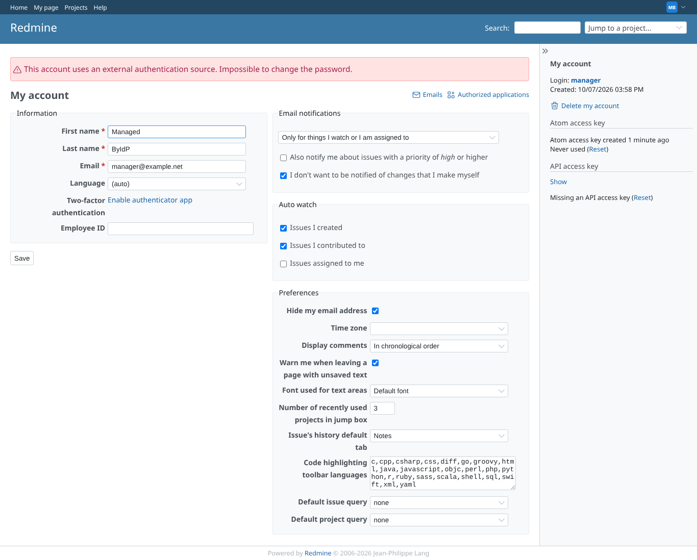
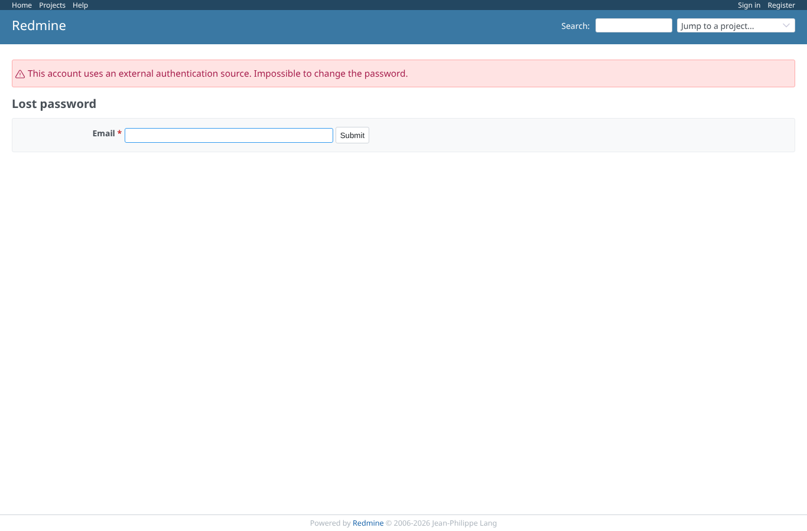
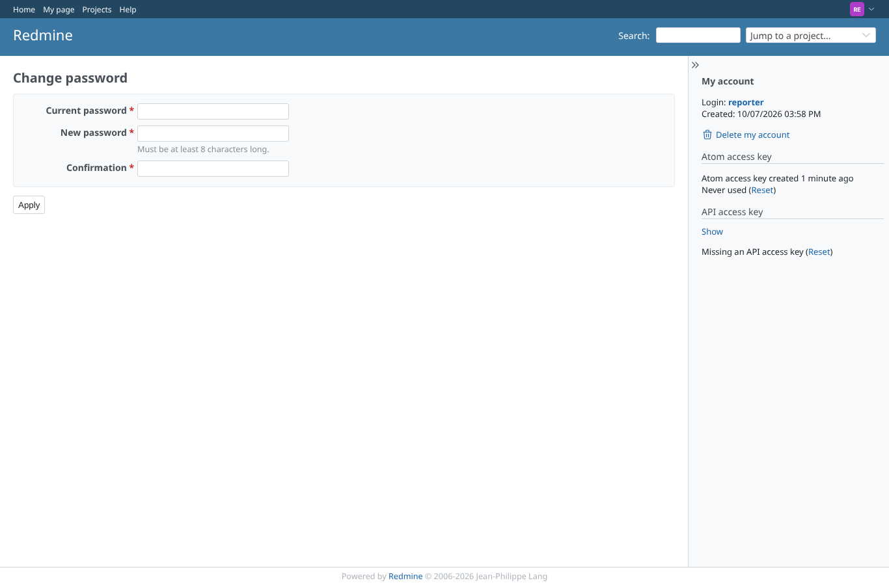
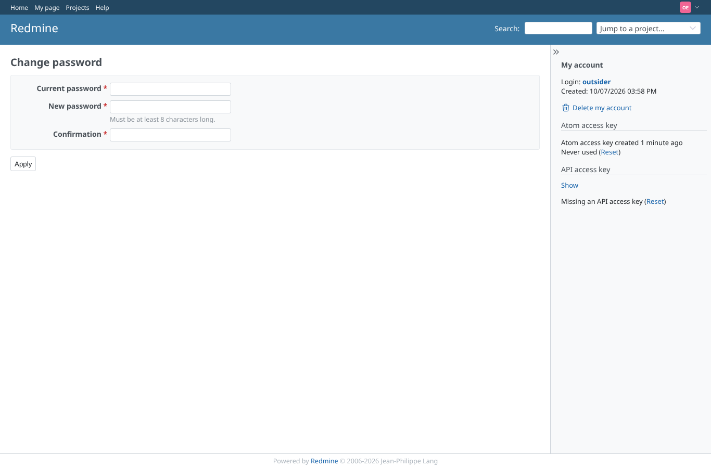
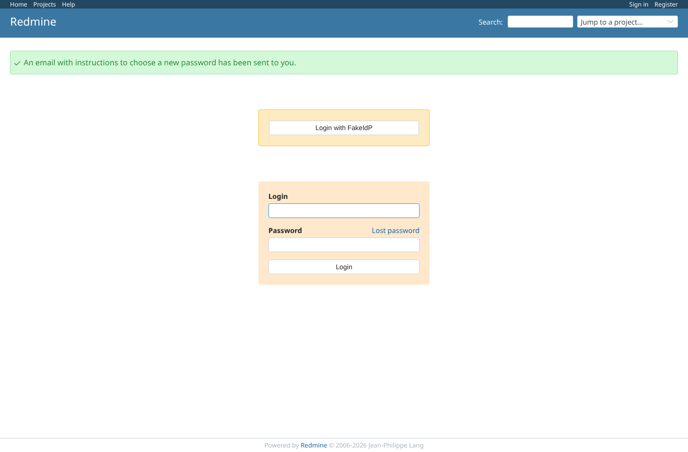
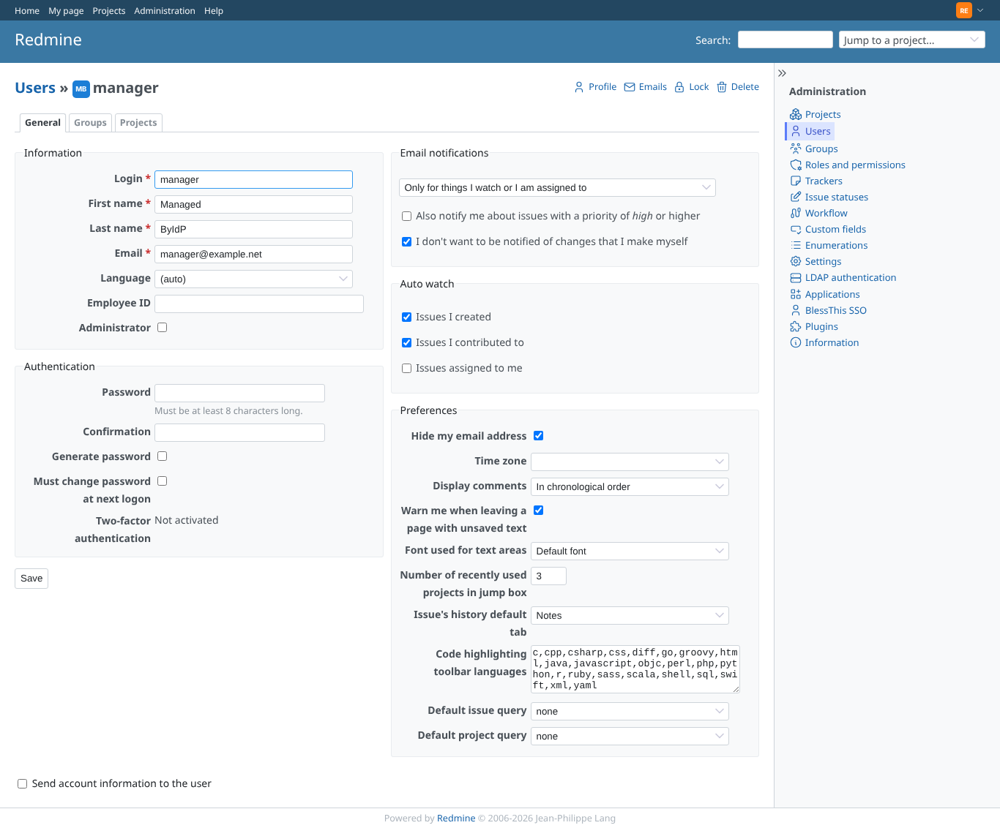

# password

Run 2026-10-07T16:00:32.844Z against http://127.0.0.1:3000.

| screenshot | user | URL | shows |
|---|---|---|---|
|  | anonymous | `/my/account` | manager after an SSO login: My account without "Change password" (the password lives at the provider) |
|  | anonymous | `/my/account` | manager opens /my/password directly: refused with core's message, back on My account |
|  | anonymous | `/account/lost_password` | Lost password for the SSO user's address: refused with core's message, no recovery mail sent |
|  | reporter | `/my/password` | reporter never signed in through SSO: "Change password" opens core's password form |
|  | outsider | `/my/password` | outsider never signed in through SSO: "Change password" opens core's password form |
|  | anonymous | `/login` | Lost password for outsider (password login only): core sends the recovery mail as before |
|  | anonymous | `/users/5/edit` | Admin (signed in through SSO, no password prompt) on the SSO user's account: the password fields are still there as a recovery path |
|  | manager | `/my/account` | With OAuth SSO turned off, manager has "Change password" again |
