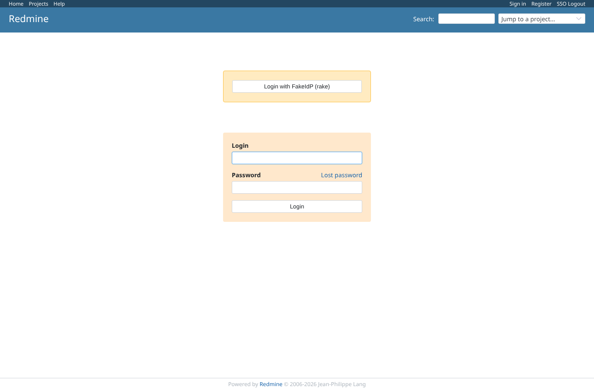

# rake_tasks

Run 2026-10-07T16:03:19.123Z against http://127.0.0.1:3000.

| screenshot | user | URL | shows |
|---|---|---|---|
|  | anonymous | `/login` | After `rake configure` with discovery: SSO is on, the button carries the configured provider name |
|  | anonymous | `http://127.0.0.1:3999/authorize?client_id=redmine-e2e&redirect_uri=http%3A%2F%2F127.0.0.1%3A3000%2Foauth%2Fcallback&scope=openid+email+profile&response_type=code&state=8b7f9cce2fec06acae1b3336d67990fb&code_challenge=Frmc4kbuYqyVePbcJ67fVpUT7XH8PN4mDr2G7FDm0_Y&code_challenge_method=S256` | After `rake enable_sso_only`: /login goes straight to the provider |
|  | anonymous | `/login` | After `rake disable_sso_only`: the password form is back next to the SSO button |
|  | anonymous | `/login` | After `rake disable`: no SSO button |
