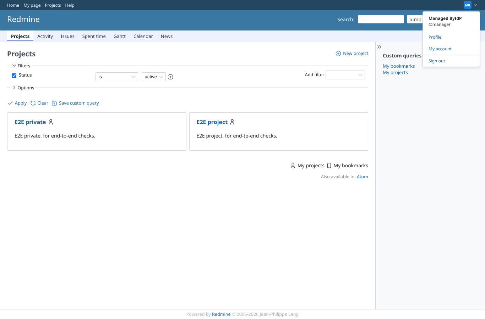
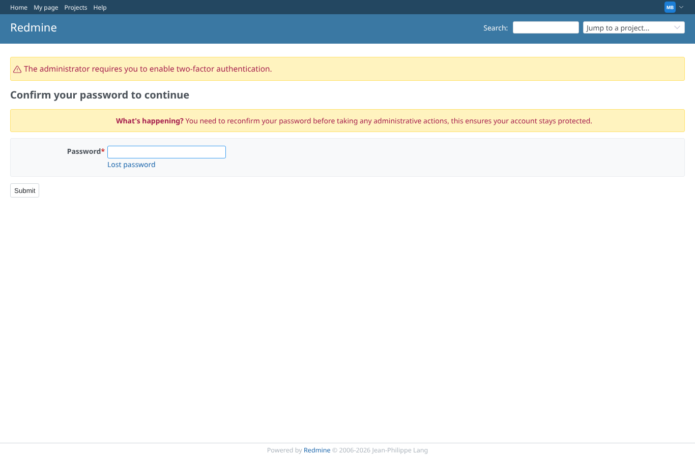
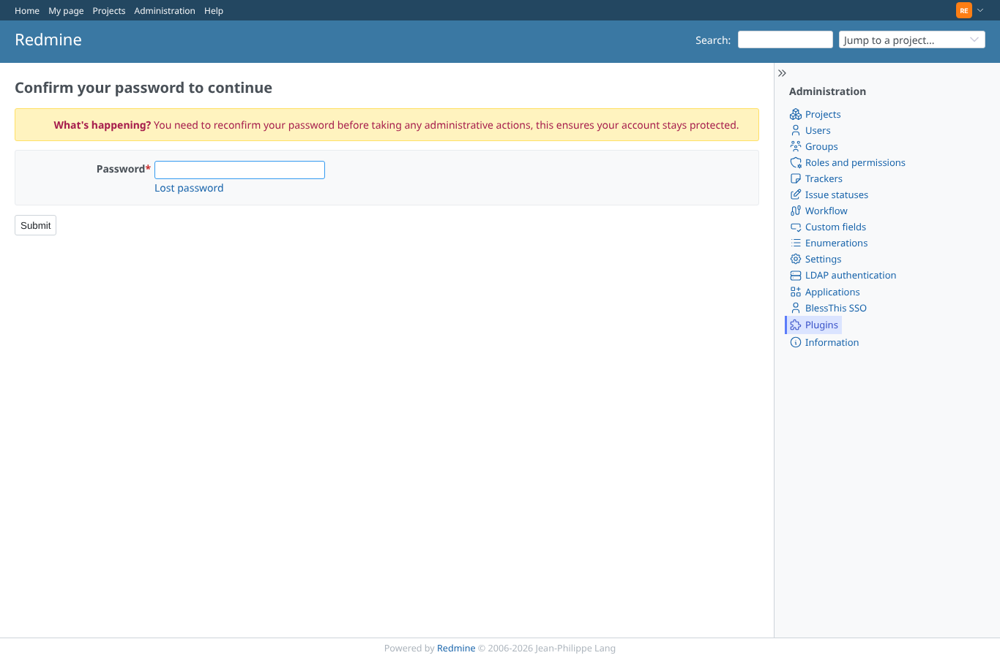
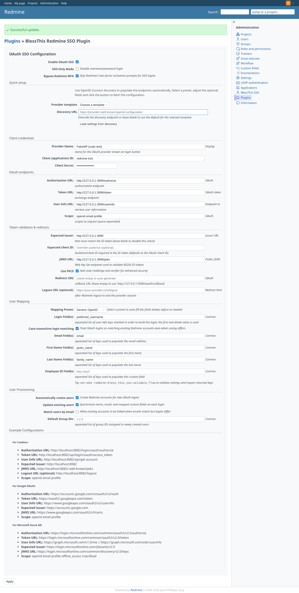
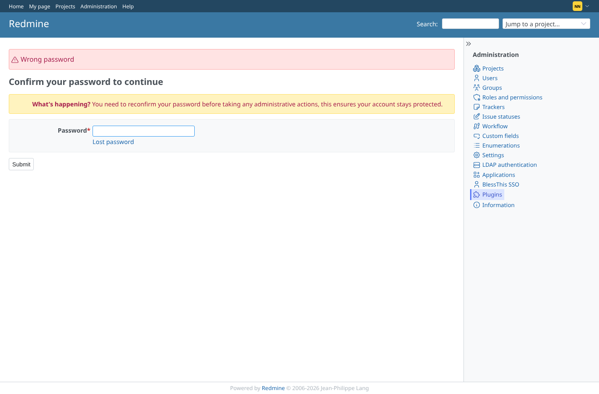

# twofa_sudo

Run 2026-10-06T19:49:02.349Z against http://127.0.0.1:3000.

| screenshot | user | URL | shows |
|---|---|---|---|
|  | anonymous | `/projects` | 2FA required by core, "Bypass Redmine MFA" on: the SSO user works without 2FA activation |
|  | anonymous | `/my/twofa/totp/activate/confirm` | 2FA required, bypass off: after the SSO login core sends the user to 2FA activation |
|  | anonymous | `/settings/plugin/bless_this_redmine_sso` | Admin logged in through SSO opens the plugin settings: Redmine 7 first asks for the password (sudo mode) |
|  | anonymous | `/settings/plugin/bless_this_redmine_sso` | With the account's Redmine password the sudo form passes and the settings are saved |
|  | anonymous | `/settings/plugin/bless_this_redmine_sso` | Admin created by SSO has no password of its own: the sudo form cannot be passed, the settings page stays closed |
