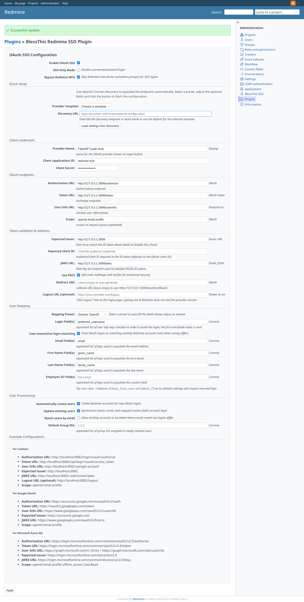
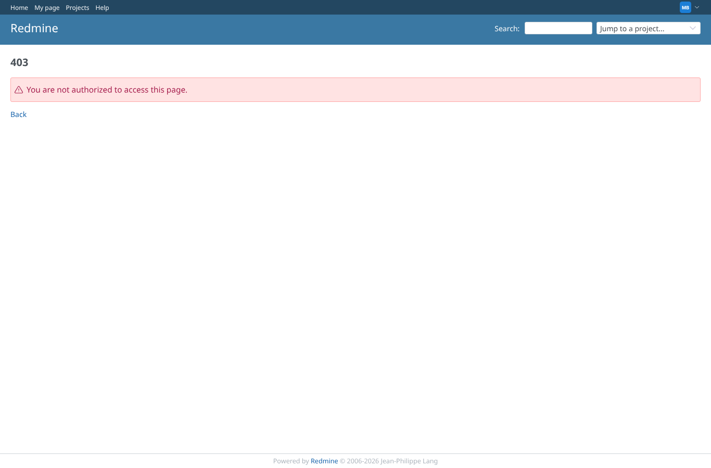

# twofa_sudo

Run 2026-10-07T16:06:56.290Z against http://127.0.0.1:3000.

| screenshot | user | URL | shows |
|---|---|---|---|
|  | anonymous | `/projects` | 2FA required by core, "Bypass Redmine MFA" on: the SSO user works without 2FA activation |
|  | anonymous | `/my/twofa/totp/activate/confirm` | 2FA required, bypass off: core sends the SSO user to 2FA activation, which opens without a password prompt because the SSO login started sudo mode |
|  | anonymous | `/settings/plugin/bless_this_redmine_sso` | Admin signed in through SSO saves the plugin settings without a password prompt: the SSO login started sudo mode |
|  | anonymous | `/settings/plugin/bless_this_redmine_sso` | Admin that only exists through SSO (no password of its own) saves the plugin settings: no password prompt, saved |
|  | anonymous | `/settings/plugin/bless_this_redmine_sso` | manager signed in through SSO: sudo mode is on but the plugin settings still answer 403 |
